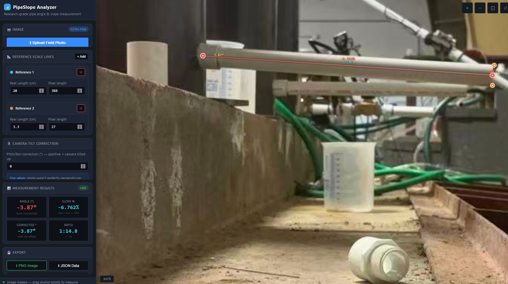

# PipeSlope Analyzer

A single-file, browser-based tool for measuring **pipe slope angles** from field photographs with research-grade precision. No install, no server — just open `index.html`.



---

## What It Does

Takes a smartphone photo of a pipe installation and lets you:

- Drag measurement lines directly onto the photo
- Calibrate real-world scale using a known dimension in the frame (pipe diameter, ruler, etc.)
- Instantly read slope angle (°), slope percentage (%), and 1:N ratio
- Correct for camera tilt introduced by imperfect smartphone positioning
- Export annotated PNG images and measurement data as JSON or CSV

---

## Quick Start

1. Open `index.html` in any modern browser (Chrome, Edge, Firefox, Safari)
2. Click **Upload Field Photo** or drag a photo onto the canvas
3. Add a Reference Line and calibrate it (see workflow below)
4. Drag the red Slope Line onto the pipe edge
5. Read results in the sidebar — export when done

No dependencies. No internet required. Works fully offline.

---

## Step-by-Step Workflow

### Step 1 — Upload your photo

Click **Upload Field Photo** in the sidebar, or drag and drop an image anywhere onto the canvas area. The photo loads and auto-fits to the screen.

Use the mouse wheel to zoom in, and drag the canvas background to pan.

### Step 2 — Add and calibrate a Reference Line

Click **+ Add** in the *Reference Scale Lines* section. A cyan line appears on the canvas.

Drag its two anchor nodes (filled circles) onto a feature in the photo whose **real-world length you know** — for example:
- The outer diameter of a pipe (e.g., 3.3 cm for a 1¼″ PVC pipe)
- A ruler or tape measure visible in the frame
- A coupling, fitting, or any dimensioned component

Then type that real length into the **Real Length (cm)** field. The tool calculates pixels-per-centimetre automatically.

Add up to **3 reference lines** for higher accuracy — the tool uses weighted least-squares fusion across all of them to reduce perspective distortion.

> **Tip from the example above:** Reference 1 spans 20 cm (388 px) along the horizontal pipe run. Reference 2 captures 3.3 cm (27 px) across the pipe wall thickness. Together they give a robust two-point scale calibration.

### Step 3 — Align the Slope Line

The red line is the slope measurement tool. Drag its two anchor nodes to lie exactly along the edge of the pipe whose slope you want to measure.

As you drag, the canvas updates live:
- The **angle arc** shows the inclination angle at the starting anchor
- The **angle (°)** and **slope %** labels float above the line
- All sidebar result fields update in real time

Use the **magnifier lens** that appears when hovering over any anchor for sub-pixel precision alignment.

### Step 4 — Apply Camera Tilt Correction (optional)

If the phone wasn't held perfectly level, enter the estimated pitch or roll offset in **Camera Tilt Correction (°)**. Positive values mean the camera was tilted upward. The corrected angle is shown separately so you can compare both values.

### Step 5 — Read and Export Results

| Field | Meaning |
|---|---|
| **Angle (°)** | Raw inclination from horizontal |
| **Slope %** | `tan(angle) × 100` — standard civil engineering slope |
| **Corrected °** | Angle after tilt offset is removed |
| **Ratio** | `1:N` format (e.g., 1:14.8 means 1 cm rise per 14.8 cm run) |
| **Line length** | Real-world length of the slope line segment (cm) |

Export options:
- **PNG Image** — full-resolution photo with measurement overlays burned in, ready for reports
- **JSON Data** — structured file with all coordinates, scale, and results
- **CSV Report** — flat table for Excel, Google Sheets, or data pipelines

---

## Example Result

From the reference photo above, two pipes are visible running horizontally across the frame. With Reference 1 set to 20 cm along the pipe run and Reference 2 set to 3.3 cm across the pipe wall:

| Measurement | Value |
|---|---|
| Raw angle | −3.87° |
| Slope | −6.762% |
| Ratio | 1:14.8 |
| Corrected angle | −3.87° (no tilt applied) |

The negative sign indicates the pipe slopes downward from left to right in the frame.

---

## Keyboard Shortcuts

| Key | Action |
|---|---|
| `+` / `=` | Zoom in |
| `-` | Zoom out |
| `F` | Fit image to screen |
| `R` | Reset view |
| Mouse wheel | Zoom at cursor |
| Drag background | Pan |

---

## Tips for Best Accuracy

- **Shoot perpendicular.** Position the camera directly to the side of the pipe, not at an angle. The closer to 90° from the pipe axis, the less perspective distortion.
- **Include a reference object.** A pipe coupling, a ruler, or any object with a known dimension in the same plane as the pipe gives you scale calibration.
- **Use multiple references.** Two or three reference lines on different parts of the frame compensate for lens distortion and improve scale accuracy.
- **Zoom in before placing anchors.** Mouse wheel zoom + the magnifier lens lets you place anchor points within a pixel or two of the pipe edge.
- **Use the tilt correction for handheld shots.** Even a 1–2° camera tilt can shift the measured slope by a similar amount on shallow-grade pipes.

---

## Files

```
slope finder/
├── index.html      ← The entire application (single file)
├── reference.jpg   ← Example screenshot showing calibrated measurement
└── README.md       ← This file
```

---

## Browser Compatibility

Tested on Chrome 120+, Edge 120+, Firefox 121+, Safari 17+. Requires Canvas 2D API and File API — both available in all modern browsers since 2015.
